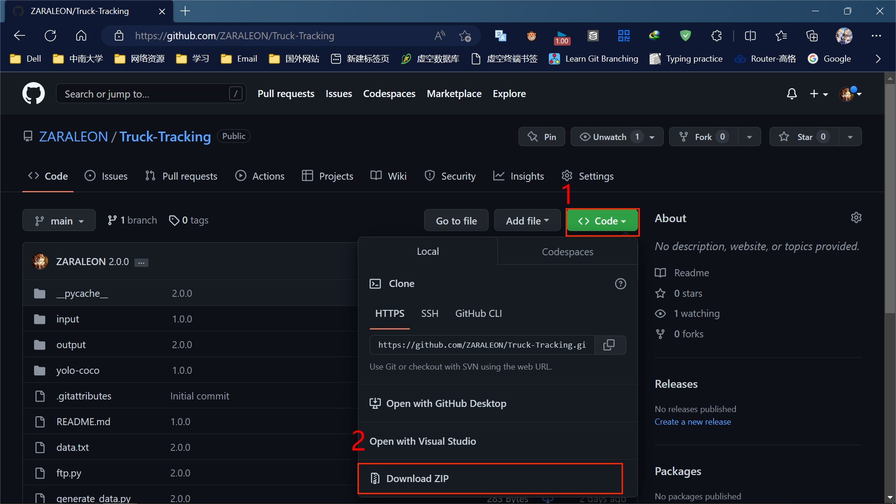
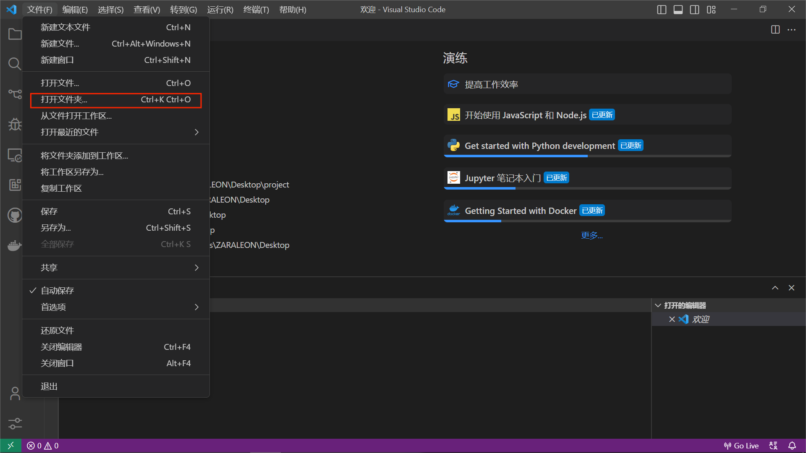
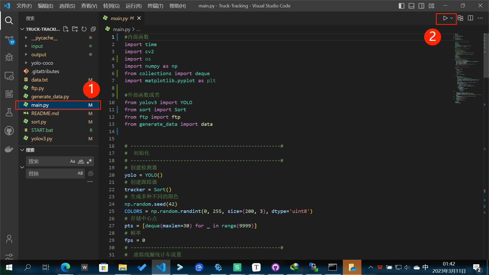
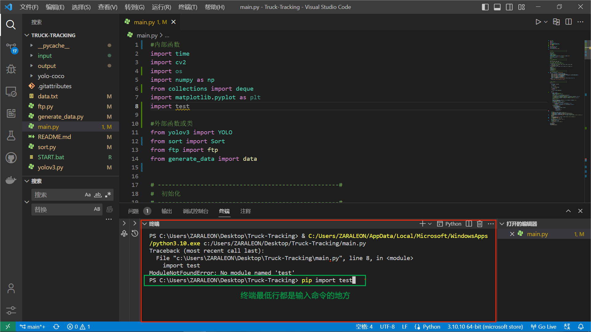
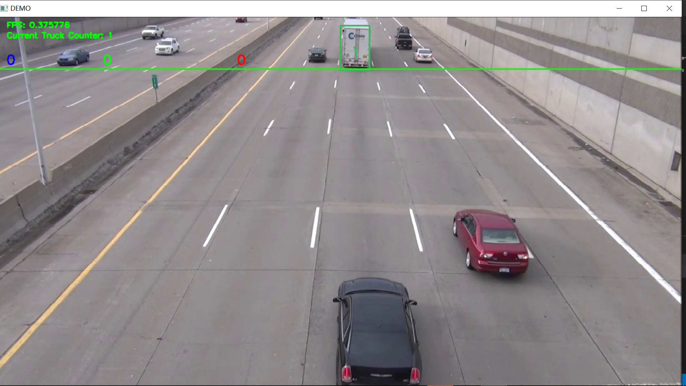
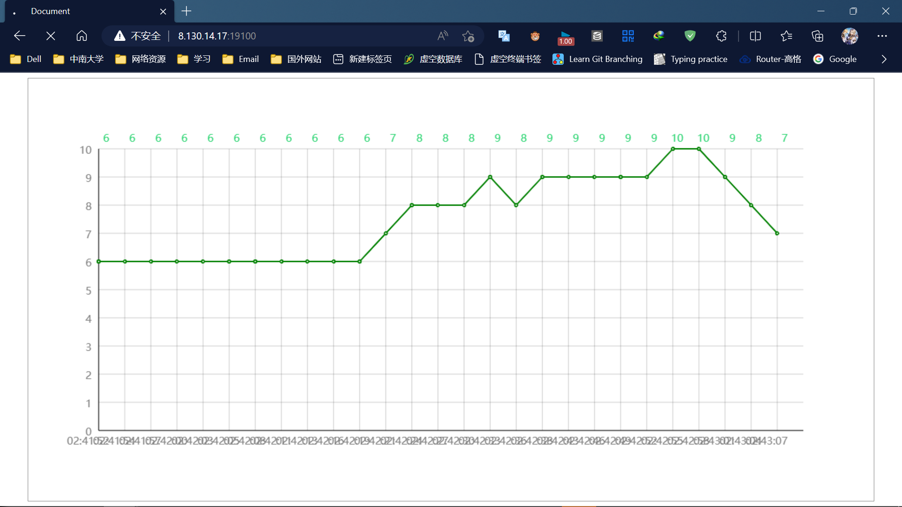
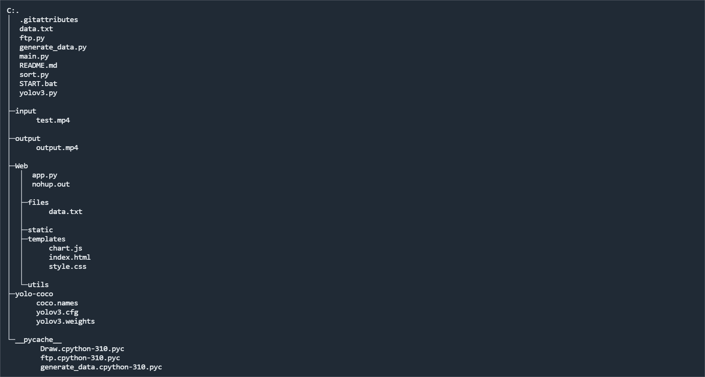

### 一、这是什么项目？

该项目为**<u>*校企合作*</u>**的大学生创新创业项目，

研究课题为"基于图像AI识别区域货车车流状态"，

课题目的为" 对于门岗、装卸货点等排队区域，安装视频设备抓取图片，通过AI识别区域内排队大货车数量，判断车流拥堵等级，并实现车流预定功能。"

自拟项目名称为”基于YOLO和OpenCV识别区域货车车流状态监测云系统“。

项目已经搭建完毕。

### 二、如何运行？

1、打开电脑cmd，执行

`git clone https://github.com/ZARALEON/Truck-Tracking `

如果提示错误，直接打开链接https://github.com/ZARALEON/Truck-Tracking

然后下载压缩包

2、 解压压缩包，使用任意一款终端软件（VS Code或者Typora），

这里演示使用VS Code，

左上角打开文件夹，选中刚刚解压出来的一整个文件夹，这样才能使代码文件都工作在同一个系统之中。

3、下载已训练好的yolov3模型对应的权重参数

官网在这里：[YOLO: Real-Time Object Detection (pjreddie.com)](https://pjreddie.com/darknet/yolo/)

建议大家通过第三方网盘下载

链接：https://pan.baidu.com/s/181q3hodxqrOBt-0fuZ9akg?pwd=2964 
提取码：2964

下载之后将其放入  Truck-Tracking/yolo-coco文件夹 里面，

否则主程序无法正确调用文件。

4、在左边文件索引栏找到main.py,

点击右上方运行程序。

 

5、大部分电脑第一次运行时都会报错无法运行，

出现

*Traceback (most recent call last):*
  *File "c:\Users\ZARALEON\Desktop\Truck-Tracking\main.py", line 8, in <module>*
    *import test* 
*ModuleNotFoundError: No module named 'test'*

类似的错误提示。

这种情况一般直接看Traceback 最低一栏，

如果像这样提示`ModuleNotFoundError: No module named 'XXX'`，

一般都是可以通过执行命令 `pip install XXX `来解决。

***特别提示，某些模块需要安装前置依赖才能正确安装，***

***如安装paramiko模块时，必须先安装PyCrypto等模块才能顺利导入。***

**一般遇到错误提示直接将关键信息输入浏览器，可以得到准确的解决方案。**

PS:如何输入命令？

一般在终端打开***<u>对应的文件夹</u>***，输入命令之后按回车键即可执行命令

6、通过上述步骤配置好环境后，执行main.py 。

即可看到程序运行起来了。

上述程序运行之后，

打开`(http://8.130.14.17:19100/)`

即可看到网页端的效果。

<u>***（PS:如果不运行程序就直接打开网页，数据是不会变化的，因为没有设备给服务器传输数据）***</u>

### 三、开发思路

整个项目主要分为两个部分，

客户端和网页端。

客户端核心文件为以下五个：

yolov3.py，#主要负责模型建立与图像识别处理。

sort.py，      #采用sort算法，使用卡尔曼滤波器对目标位置进行估计，利用匈牙利算法进行目标关联。

相关文章链接如下：

卡尔曼滤波https://zhuanlan.zhihu.com/p/45238681

匈牙利算法http://note.youdao.com/s/QsRIcLcJ

generate_data.py，#主要负责数据记录并且保存为文本文件。

ftp.py，                    #主要负责对服务器的单向数据传输。

main.py。                #整合上述文件的函数，进行有序调用。

网页端主要整合到了Web文件夹，

主要是应用Flask框架，

使用Python文件，

通过读取上传的数据文件应用chart.js即可完成基础工作。

